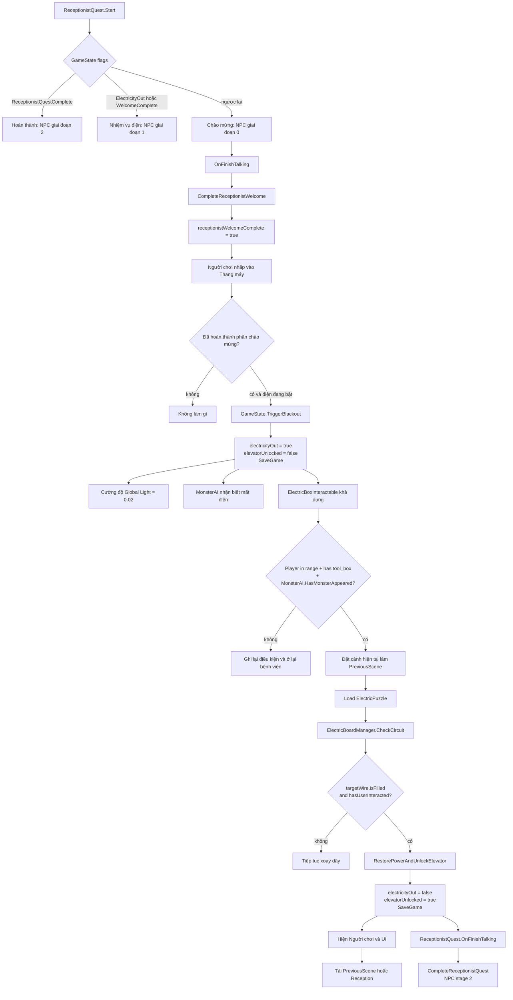
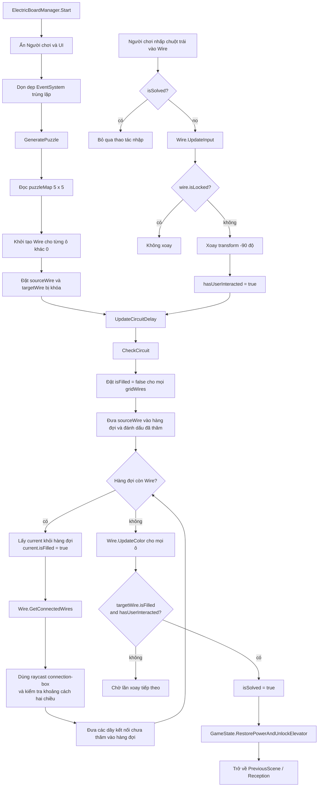
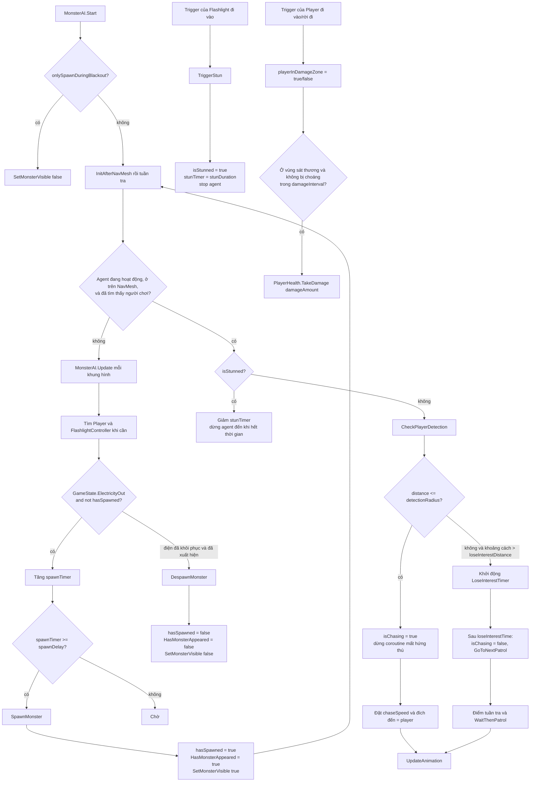
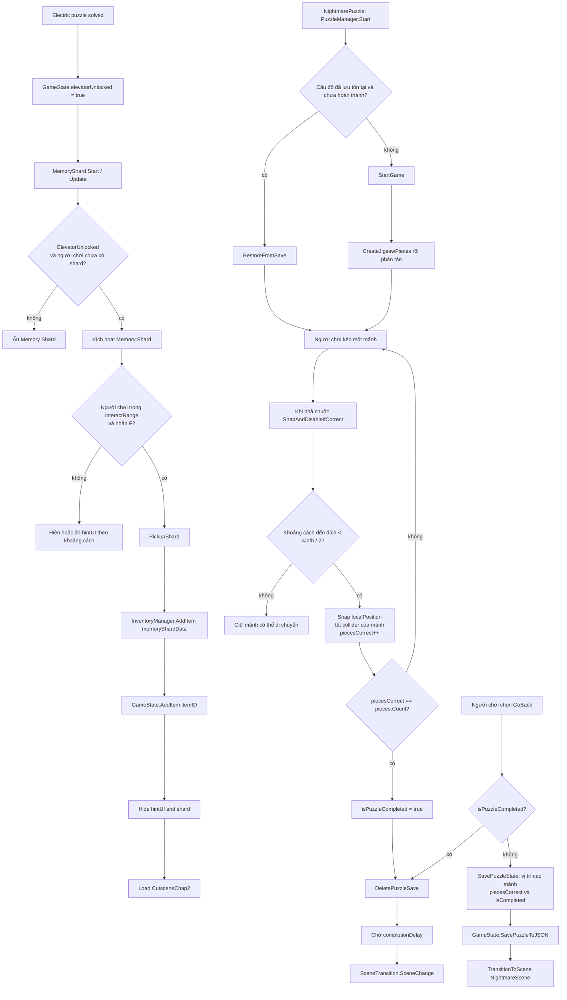
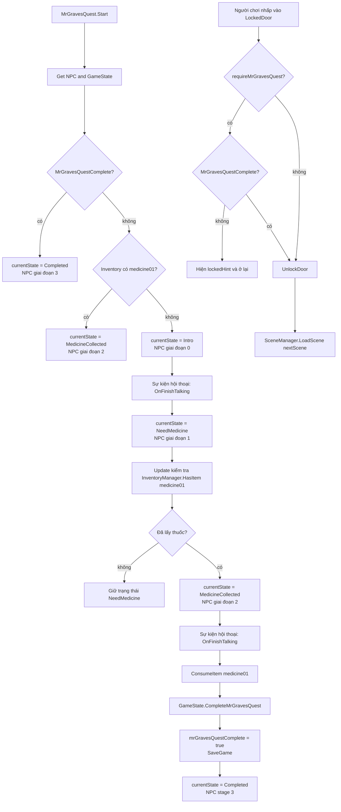

# Sơ đồ luồng Mermaid

Dán bất kỳ khối `mermaid` nào bên dưới vào [Mermaid Live Editor](https://mermaid.live/) để hiển thị sơ đồ.

## 1. Bệnh viện: Lễ tân, mất điện, câu đố điện, mở khóa thang máy

## 2. Câu đố điện: xoay dây và kiểm tra mạch theo chiều rộng

## 3. MonsterAI: xuất hiện khi mất điện, tuần tra, truy đuổi, choáng, gây sát thương

## 4. Chương 2: Memory Shard và NightmarePuzzle

## 5. Chương 3: nhiệm vụ Mr. Graves và căn phòng bị khóa

## Biến trạng thái được tham chiếu trong sơ đồ

| Hệ thống | Biến / trường được lưu |
| --- | --- |
| Bệnh viện và câu đố điện | `receptionistWelcomeComplete`, `receptionistQuestComplete`, `electricityOut`, `elevatorUnlocked`, `PreviousScene`, `isSolved`, `_hasUserInteracted`, `sourceWire`, `targetWire` |
| MonsterAI | `hasSpawned`, `HasMonsterAppeared`, `spawnTimer`, `isChasing`, `isStunned`, `stunTimer`, `playerInDamageZone`, `damageTimer` |
| Mảnh ký ức | `memoryShardData.itemID`, `interactRange`, `cutsceneSceneName` |
| NightmarePuzzle | `pieces`, `draggingPiece`, `piecesCorrect`, `isPuzzleCompleted`, `PuzzleSaveData` |
| Mr. Graves và cánh cửa | `currentState`, `itemID`, `mrGravesQuestComplete`, `requireMrGravesQuest`, `nextScene` |
